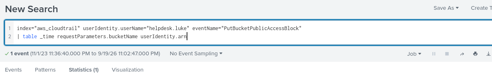

# AWSRaid — Investigation Walkthrough

## Lab Overview

**Platform:** CyberDefenders  
**Lab:** AWSRaid  
**SIEM:** Splunk  
**Data Source:** AWS CloudTrail

### Objective

The objective of this investigation is to analyze AWS CloudTrail activity,
identify the compromised account, trace the attacker's actions, and determine
the affected AWS resources.

---

# Investigation


### Question 1

Knowing which user account was compromised is essential for understanding the attacker's initial entry point into the environment. What is the username of the compromised user?

### Investigation

We begin by examining the AWS identities present in the CloudTrail data.

```spl
index="aws_cloudtrail" eventSource="signin.amazonaws.com" errorMessage="Failed authentication" | stats count by userIdentity.userName | sort -count
```

### Question 2

We must investigate the events following the initial compromise to understand the attacker's motives. What is the timestamp for the first access to an S3 object by the attacker?

### Investigation

After identifying the compromised account, we can focus on its S3 activity.

```spl
index="aws_cloudtrail" "userIdentity.userName"="helpdesk.luke" eventSource="s3.amazonaws.com" eventName="GetObject" | table _time, eventName, requestParameters.bucketName, requestParameters.key
```

### Question 3

Among the S3 buckets accessed by the attacker, one contains a DWG file. What is the name of this bucket?

### Investigation

We investigate the S3 object requests made by the attacker and examine the requested object paths.

```spl
index="aws_cloudtrail" "userIdentity.userName"="helpdesk.luke" eventSource="s3.amazonaws.com" eventName="GetObject" "*.dwg" | table _time, requestParameters.bucketName, requestParameters.key
```

### Question 4

We've identified changes to a bucket's configuration that allowed public access, a significant security concern. What is the name of this particular S3 bucket?

### Investigation 

We investigate S3 configuration changes and bucket access-control events.




