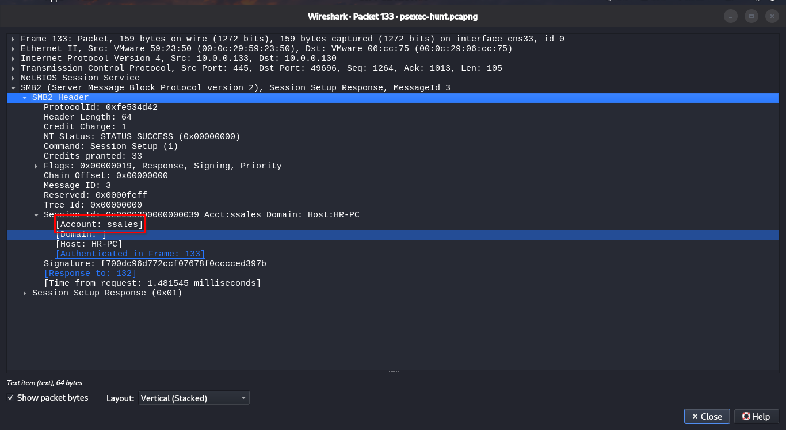
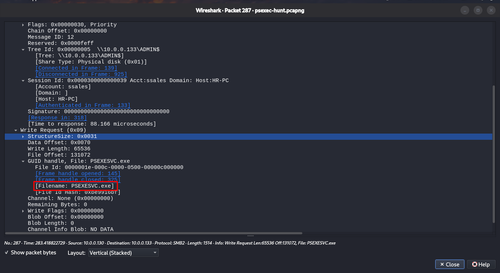
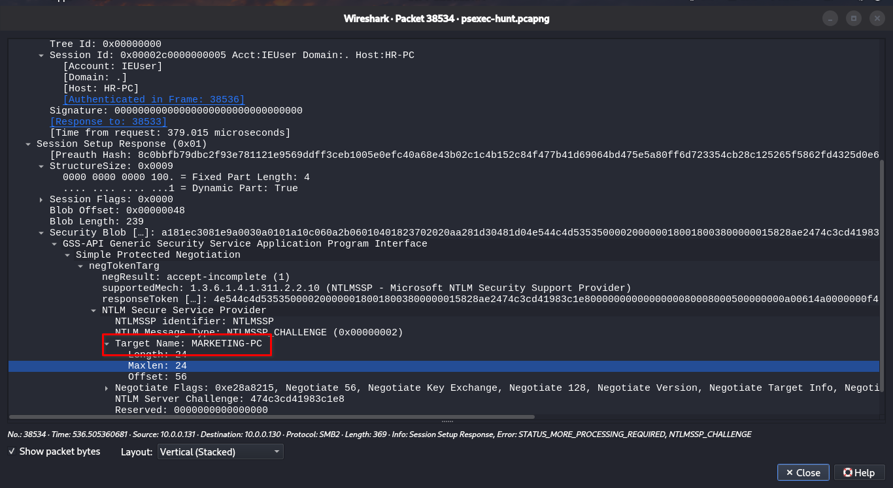
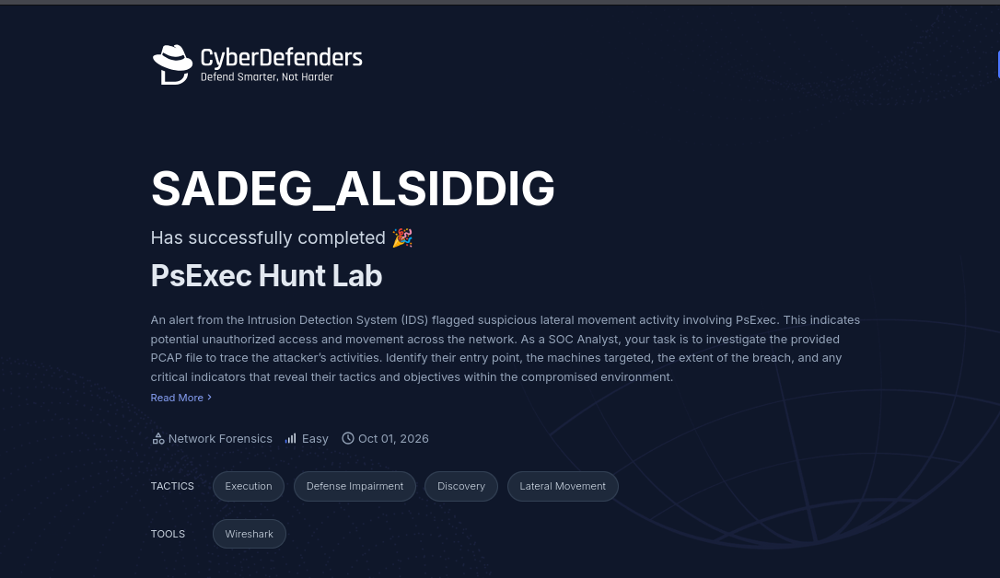

# PsExec Hunt Lab: Walkthrough

Step-by-step solution for each question, with the Wireshark filters and reasoning behind every answer.

## Step 0: Get Oriented

Open the PCAP in Wireshark and get a high-level view before filtering.

**Statistics > Protocol Hierarchy:** confirm SMB2, NTLMSSP, and DCERPC are present.

**Statistics > Conversations > IPv4:** note which hosts talk to each other the most.

Heavy SMB2 traffic between a small set of hosts is the first sign of lateral movement.


### Q1: To effectively trace the attacker's activities within our network, can you identify the IP address of the machine from which the attacker initially gained access?

**Goal:** find the machine the attacker was operating from.
1. Filter for SMB2 session setup requests:
   ```
   smb2.cmd == 1
   ```
2. Look at who initiates the connections. The source of the authentication attempts toward other hosts is the attacker's machine.
3. Cross-check in *Statistics > Conversations* that this host is the one opening SMB sessions to others.

**Answer:** `10.0.0.130`


### Q2: To fully understand the extent of the breach, can you determine the machine's hostname to which the attacker first pivoted?

**Goal:** identify the first machine the attacker moved to.

1. Filter for NTLM authentication:
   ```
   ntlmssp
   ```
2. Open an `NTLMSSP_CHALLENGE` packet from the target. Under **NTLM Server Challenge > Target** Info check **NetBIOS Computer Name** and **DNS Computer Name**.
3. The destination of the first SMB session from `10.0.0.130` gives the first pivot.

**Answer:** `SALES-PC`


### Q3: Knowing the username of the account the attacker used for authentication will give us insights into the extent of the breach. What is the username utilized by the attacker for authentication?

**Goal:** identify the account the attacker used.

1. Filter for the NTLM authenticate message:
   ```
   ntlmssp.auth.username
   ```
2. Expand the packet: *NTLM Secure Service Provider* and read **Account name**, **Domain name**, and **Host name**.

**Answer:** `ssales`



### Q4: After figuring out how the attacker moved within our network, we need to know what they did on the target machine. What's the name of the service executable the attacker set up on the target?

**Goal:** find the binary PsExec dropped on the target.

1. Filter for SMB2 Create requests that mention PsExec:
   ```
   smb2.cmd == 5 && smb2.filename contains "PSEXESVC"
   ```
2. Check the **Filename** field. You should see the binary being created, followed by Write requests carrying its content.


**Answer:** `PSEXESVC.EXE`



### Q5: We need to know how the attacker installed the service on the compromised machine to understand the attacker's lateral movement tactics. This can help identify other affected systems. Which network share was used by PsExec to install the service on the target machine?

**Goal:** find the share used to copy the service binary.

1. Filter for tree connect requests:
   ```
   smb2.cmd == 3
   ```
2. Read the **Tree** field (like `\\10.0.0.133\ADMIN$`).
3. Match the timing: the `ADMIN$` connection occurs just before `PSEXESVC.EXE` is written.

**Answer:** `ADMIN$`

**Why it matters:** `ADMIN$` maps to `C:\Windows` and requires administrative rights. Writing there is how PsExec places its service binary.

### Q6: We must identify the network share used to communicate between the two machines. Which network share did PsExec use for communication?

**Goal:** find the share used once the service is running.

1. Using the same `smb2.cmd == 3` filter, look for a second tree connect after the service starts.
2. Look for named pipe activity:
   ```
   smb2.filename contains "PSEXESVC"
   ```
   Pipes such as `PSEXESVC` and its stdin/stdout/stderr pipes carry commands and output.

**Answer:** `IPC$`

**Why it matters:** `IPC$` provides named pipe access, which PsExec uses as its remote command channel.

### Q7: Now that we have a clearer picture of the attacker's activities on the compromised machine, it's important to identify any further lateral movement. What is the hostname of the second machine the attacker targeted to pivot within our network?

**Goal:** identify further lateral movement.

1. Return to the attacker's conversations in *Statistics > Conversations*. Look for another host receiving SMB traffic after the first pivot is complete.
2. Repeat the Q2 steps (NTLM challenge, Target Info) for that second destination.
3. Confirm the same PsExec pattern: `ADMIN$` connection, `PSEXESVC.EXE` write, then `IPC$`.

**Answer:** `MARKETING-PC`



## Attack Timeline

| Step | Activity | Details |
|------|----------|---------|
| 1 | Attacker foothold | Operating from `10.0.0.130` |
| 2 | Authentication | NTLM login as `ssales` |
| 3 | First pivot | Connection to `SALES-PC` |
| 4 | Service install | `PSEXESVC.EXE` copied via `ADMIN$` |
| 5 | Remote execution | Commands and output over `IPC$` named pipes |
| 6 | Second pivot | Same technique used against `MARKETING-PC` |

## MITRE ATT&CK Mapping

| ID | Technique | Observed Behavior |
|----|-----------|-------------------|
| T1078 | Valid Accounts | Login with `ssales` |
| T1021.002 | Remote Services: SMB/Windows Admin Shares | `ADMIN$` and `IPC$` access |
| T1569.002 | System Services: Service Execution | `PSEXESVC` service created and started |

## Indicators of Compromise (IOCs)

| Type | Value |
|------|-------|
| Source IP | `10.0.0.130` |
| Compromised account | `ssales` |
| Targeted hosts | `SALES-PC`, `MARKETING-PC` |
| Service binary | `PSEXESVC.EXE` |
| Shares abused | `ADMIN$`, `IPC$` |


### Lab Completion



**I hope this write-up was helpful to you, Until the next one stay safe.**


