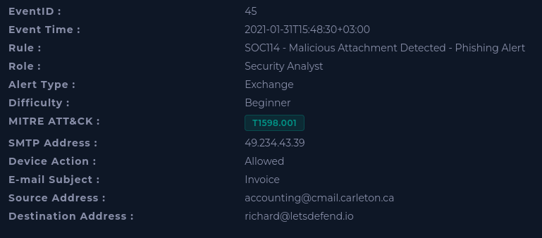
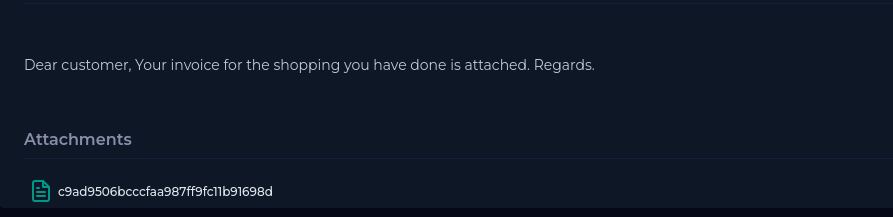
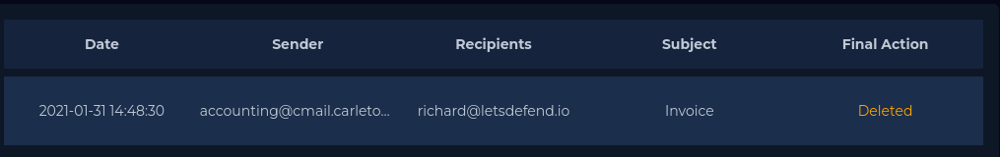
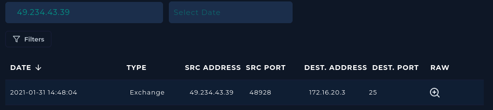
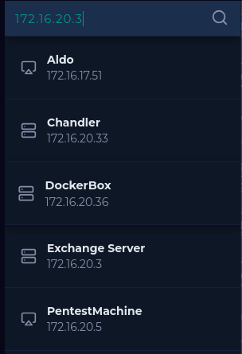
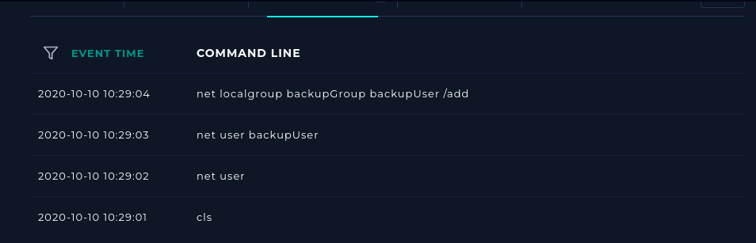
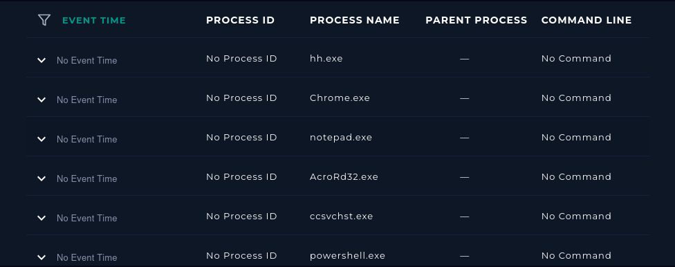

# SOC114 - Malicious Attachment Detected - Phishing Alert

| | |
|---|---|
| **Platform** | LetsDefend |
| **Event ID** | 45 |
| **Rule** | SOC114 - Malicious Attachment Detected - Phishing Alert |
| **Level** | Security Analyst |

## 1. Alert Details

| Field | Value |
|---|---|
| Event time | January 31, 2021, 15:48 PM |
| SMTP address | 49.234.43.39 |
| Sender | accounting@cmail.carleton.ca |
| Recipient | richard@letsdefed.io |
| Subject | Invoice |
| Device action | Allowed |

## 2. Step-by-Step Investigation

### Step 1 – Read the alert details
I read the alert SOC114 (Event ID 45) and recorded the time, SMTP address, sender, recipient, subject and device action

### Step 2 – Parse the email
I Answered the playbook questions: when it was sent, the SMTP address, the sender and the recipient. Then opened the email body:

> Dear customer, Your invoice for the shopping you have done is attached. Regards.

The mail has one attachment.

### Step 3 – Judge the content
The mail is suspicious for these reasons:

The email content is suspicious because it uses a generic greeting, provides no specific purchase or transaction details, and contains an unexpected invoice attachment.

### Step 4 – Analyze the attachment

Using the hash `c9ad9506bcccfaa987ff9fc11b91698d` on virustotal the result provide us the file has 37 security vendor flagged this file as malicious 

### Step 5 – Check if the mail was delivered
The device action is **Allowed** so the email is delivered to the target but after searched in Email security they deleted the email before the recipient opened it.

### Step 6 – Review the sender's history

after searched in Email Security they are send one email to one target

### Step 7 – Check the endpoints

First I searched the log management to Know the destination address the email was send and look for the endpoint to see any suspicious pattern.

The history of the Command Line and Process it's not suspicious and we know that because the email was already deleted before the recipient open it.

### Step 8 – Contain, document and close

The alert was True positive.

