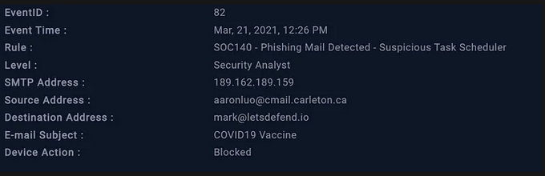
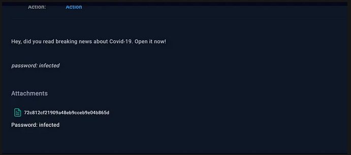
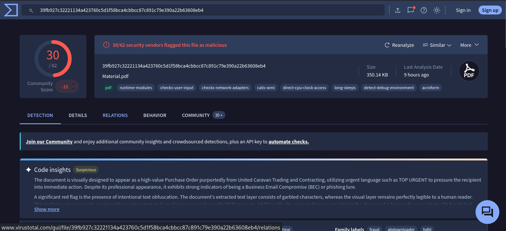
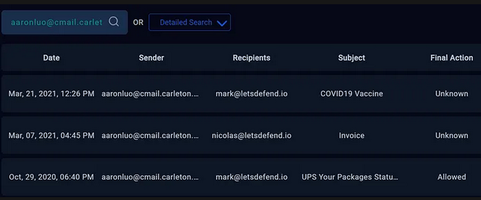
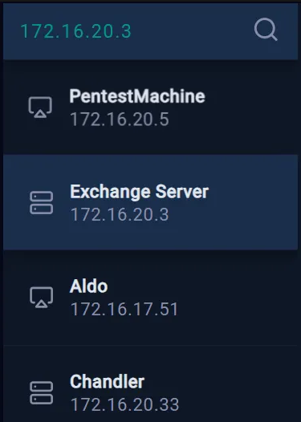
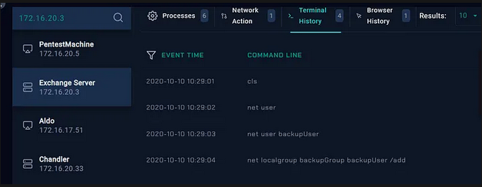
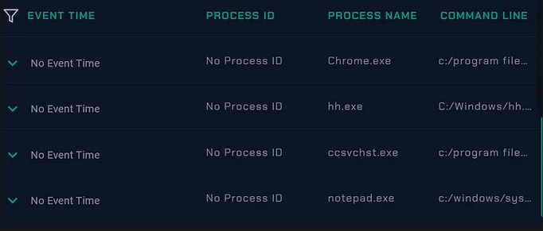

# LetsDefend Write-Up: SOC140 – Phishing Mail Detected – Suspicious Task Scheduler

| | |
|---|---|
| **Platform** | LetsDefend |
| **Event ID** | 82 |
| **Rule** | SOC140 - Phishing Mail Detected - Suspicious Task Scheduler |
| **Level** | Security Analyst |


## 1. Alert Details

| Field | Value |
|---|---|
| Event time | Mar 21, 2021, 12:26 PM |
| SMTP address | 189.162.189.159 |
| Sender | aaronluo@cmail.carleton.ca |
| Recipient | mark@letsdefend.io |
| Subject | COVID19 Vaccine |
| Device action | Blocked |




## 2. Step-by-Step Investigation

### Step 1 – Read the alert details
I read the alert SOC140 (Event ID 82) and recorded the time, SMTP address, sender, recipient, subject and device action

### Step 2 – Parse the email
I Answered the playbook questions: when it was sent, the SMTP address, the sender and the recipient. Then opened the email body:

> Hey, did you read breaking news about Covid-19. Open it now!
> password: infected

The mail has one attachment.



### Step 3 – Judge the content
The mail is suspicious for these reasons:

1. **Urgency.** "Open it now!" pressures the recipient to act without thinking.
2. **Topical lure.** COVID-19 news was a common social-engineering theme in 2021.
3. **Password for the attachment.** The password is given in the body, a common way to stop mail gateways and AV from scanning the contents.
4. **Generic message.** No greeting or context, from an external sender to a corporate user.

### Step 4 – Analyze the attachment
Using the hash `72c812cf21909a48eb9cceb9e04b865d` on virustotal the results revealed that 30 security vendors flagged this file as a malicious and most of them labelled it as trojan. This reinforces the suspicion raised during the initial investigation.




### Step 5 – Check if the mail was delivered
The device action is **Blocked**, so the mail was most likely not delivered or executed

### Step 6 – Review the sender's history
Searching `aaronluo@cmail.carleton.ca` in Email Security shows:

| Date | Recipient | Subject | Final action |
|---|---|---|---|
| Mar 21, 2021, 12:26 PM | mark@letsdefend.io | COVID19 Vaccine | Unknown |
| Mar 07, 2021, 04:45 PM | nicolas@letsdefend.io | Invoice | Unknown |
| Oct 29, 2020, 06:40 PM | mark@letsdefend.io | UPS Your Packages Status | Allowed |

We just focus on the subject COVID19 Vaccine.



### Step 7 – Check the endpoints


- I Searched for `172.16.20.3` in Endpoint Security and was returned the **Exchange Server**. This is the mail server, not the recipient's workstation.

  
  
- **Terminal history**:
  ```
  cls
  net user
  net user backupUser
  net localgroup backupGroup backupUser /add
  ```
  This is a suspicious account-creation pattern, but it predates the alert and cannot be tied to this email.

  
  
- **Process list** (Chrome.exe, hh.exe, ccsvchst.exe, notepad.exe): no hostname, no process IDs and every row says "No Event Time", so no execution can be linked to this email. `ccsvchst.exe` is normally a Symantec service, so it is not malicious without more evidence.

### Step 8 – Contain, document and close
Closed the alert as **True Positive** with an analyst note covering the findings, IoCs and open points.


