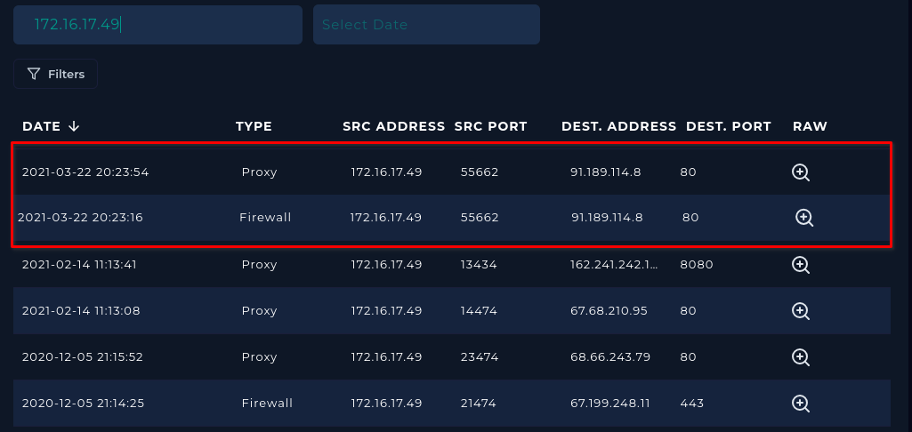
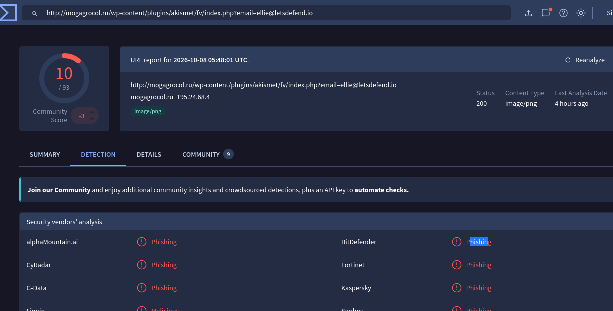

# LetsDefend Write-Up: SOC141 – Phishing URL Detected

| | |
|---|---|
| **Platform** | LetsDefend |
| **Event ID** | 86 |
| **Rule** | SOC141 - Phishing URL Detected |
| **Level** | Security Analyst |

## 1. Alert Details

| Field | Value |
|---|---|
| Event time | March 22 2021 21:23 PM |
| Username | ellie |
| Source Hostname | EmilyComp |
| Source Address | 172.16.17.49 |
| Destination Address | 91.189.114.8 |
| Destination Hostname | mogagrocol.ru |

## Step 1 - Read the alert details
I read the alert SOC141 (Event ID 86) and recorded the time, Username, Source address, Source Host name, Destination Address, Destination Host name and device action

## Step 2 - Check the log management
I used the Source IP in log management and saw there are connection with the Source Address to URL

## Step 3 - Analyze the URL
In virustotal I search for URL it's return it as a malicious URL

## Step 4 - Check if the URL Delivered or anyone connected to it
I used the Destination IP of the URL and search with it in log management to saw if anyone connected to this URL and it's return one Device and it's the same device that alert come from it

