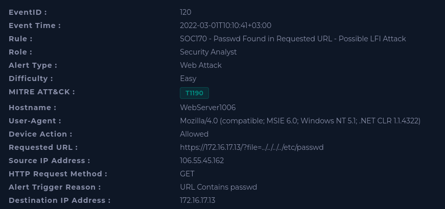
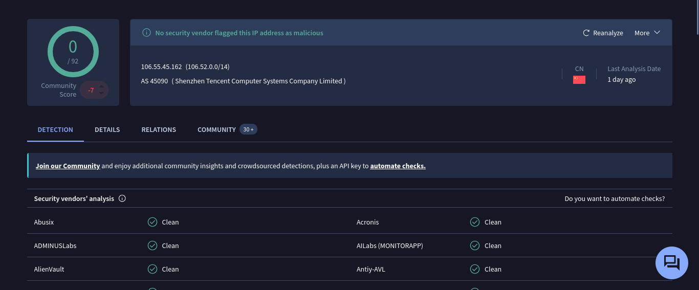
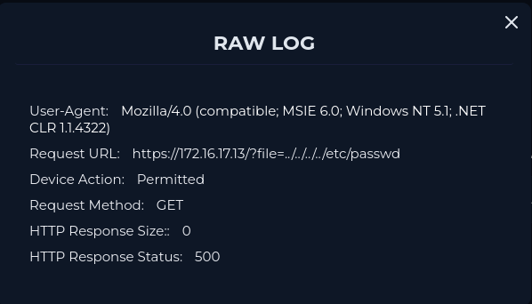

# SOC170 - Passwd Found in Requested URL - Possible LFI Attack

| | |
|---|---|
| **Platform** | LetsDefend |
| **Event ID** | 120 |
| **Rule** | SOC170 - Passwd Found in Requested URL - Possible LFI Attack |
| **Level** | Security Analyst |

## 1. Alert Details

## Step 1 - Understand Why the Alert Was Triggered

The alert was triggered because a possible Local File Inclusion (LFI) attack was detected in the following URL request:

`https://172.16.17.13/?file=../../../../etc/passwd`

The request uses a path traversal technique (`../`) to move up the directory tree and read `/etc/passwd`, a sensitive system file on Linux servers. If the application does not properly validate the `file` parameter, this server-side vulnerability can expose sensitive information about the server.

## Step 2 - Collect Data

- **Source IP:** `106.55.45.162` (external, from the internet)
- **Destination IP:** `172.16.17.13`
- **Destination hostname:** `WebServer1006`
- **Traffic direction:** Internet → Company network

The traffic came from the internet, not from the internal network. I checked the source IP on VirusTotal and it was not flagged as malicious.

A clean reputation does not mean the activity is harmless. Attackers often use new or unlisted IPs, so the decision must be based on the request content.

## Step 3 - Is the Traffic Malicious?

**Yes.** The request came from an external source and contains a path traversal payload aimed at reading a sensitive system file. This is not normal user behavior.

## Step 4 - What Is the Attack Type?

Based on the payload `../../../../etc/passwd`, this is an **LFI (Local File Inclusion) / Path Traversal attack**. The attacker tried to read a local file on the server by manipulating the `file` parameter.

## Step 5 - Check Whether the Attack Was Successful

I searched Log Management using the source IP to find the server's response to the malicious request. The log shows:

- **HTTP status code:** `500` (Internal Server Error)
- **Response size:** `0` bytes

A response size of 0 means no data was returned to the attacker, so the contents of `/etc/passwd` were not disclosed. The 500 status means the server failed while processing the request. **The attack was not successful.**

## Step 6 - Verdict, Contain and Escalation

**Verdict:** True Positive. Malicious attempt, unsuccessful.

**Containment:** Not required, since no compromise is indicated. Device isolation is unnecessary.

**Escalation:** Not necessary, because the Attack was unsuccessful.

