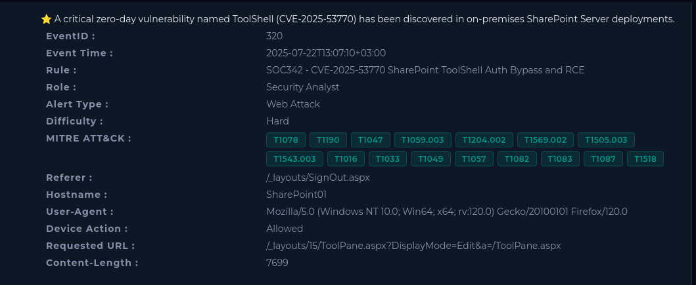
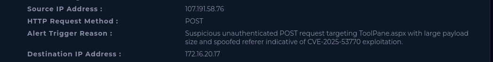

# SOC342 - CVE‑2025‑53770 SharePoint ToolShell Auth Bypass and RCE

| | |
|---|---|
| **Platform** | LetsDefend |
| **Event ID** | 320 |
| **Rule** | SOC342 - CVE‑2025‑53770 SharePoint ToolShell Auth Bypass and RCE |
| **Level** | Security Analyst |

## Alert Details

## Step 1 - Understand Why the Alert Was Trigger

