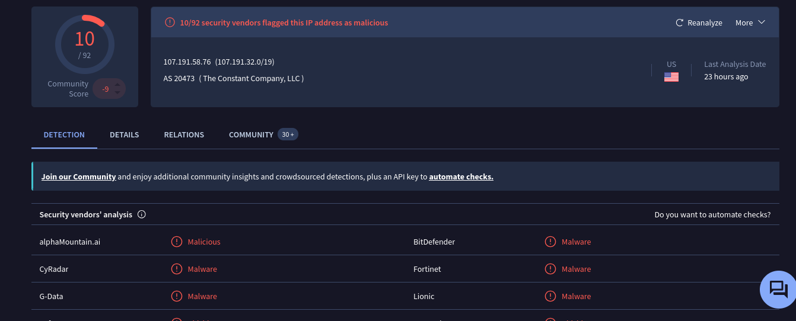

# SOC342 - CVE‑2025‑53770 SharePoint ToolShell Auth Bypass and RCE

| | |
|---|---|
| **Platform** | LetsDefend |
| **Event ID** | 320 |
| **Rule** | SOC342 - CVE‑2025‑53770 SharePoint ToolShell Auth Bypass and RCE |
| **Level** | Security Analyst |

## Alert Details

## Step 1 - Understand Why the Alert Was Trigger

With looking on the rule the alert comes because there are a CVE-2025-53770 was detected this CVE involving in SharePoint ToolShell this can break the authentication and lead to Remote Code Exceusion `RCE` By exploit this vulnerability on SharePoint ToolShell App.

## Step 2 - Collect Data

**Source IP:** `107.191.58.76` (external, from the internet).

**Destination IP:** `172.16.20.17`.

**Destination Host Name:** `SharePoint01`.

**User-Agent:** `Mozilla/5.0 (Windows NT 10.0; Win64; x64; rv:120.0) Gecko/20100101 Firefox/120.0`.

I Searched about the Source IP in virustotal and return 10 security vendors flagged this IP as malicious

## Step 3 - Examine HTTP Traffic

