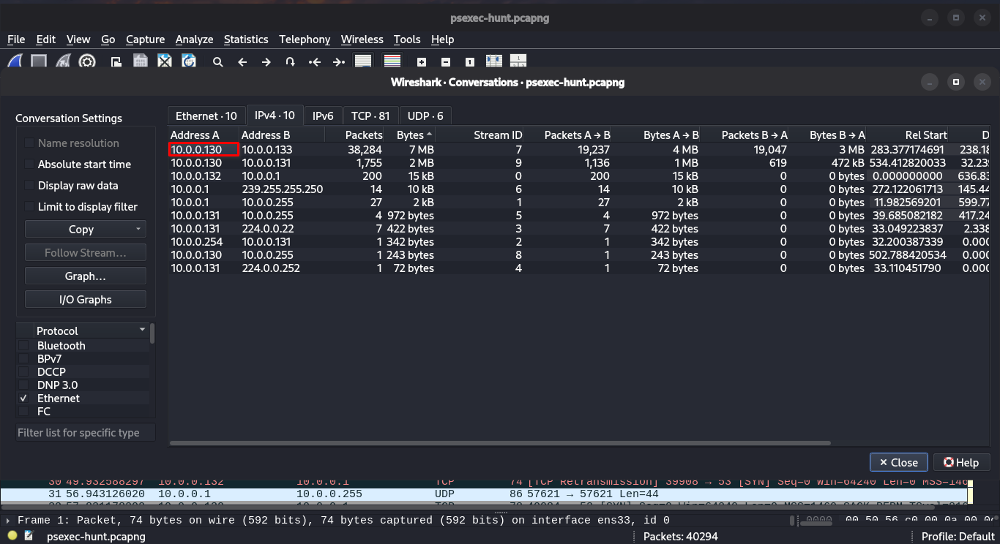

# PsExec Hunt Lab: Walkthrough

Step-by-step solution for each question, with the Wireshark filters and reasoning behind every answer.

## Step 0: Get Oriented

Open the PCAP in Wireshark and get a high-level view before filtering.

**Statistics > Protocol Hierarchy:** confirm SMB2, NTLMSSP, and DCERPC are present.

**Statistics > Conversations > IPv4:** note which hosts talk to each other the most.

Heavy SMB2 traffic between a small set of hosts is the first sign of lateral movement.


# Q1: To effectively trace the attacker's activities within our network, can you identify the IP address of the machine from which the attacker initially gained access?

**Goal:** find the machine the attacker was operating from.
1. Filter for SMB2 session setup requests:
   ```
   smb2.cmd == 1
   ```
2. Look at who initiates the connections. The source of the authentication attempts toward other hosts is the attacker's machine.
3. Cross-check in *Statistics > Conversations* that this host is the one opening SMB sessions to others.

**Answer:** `10.0.0.130`



