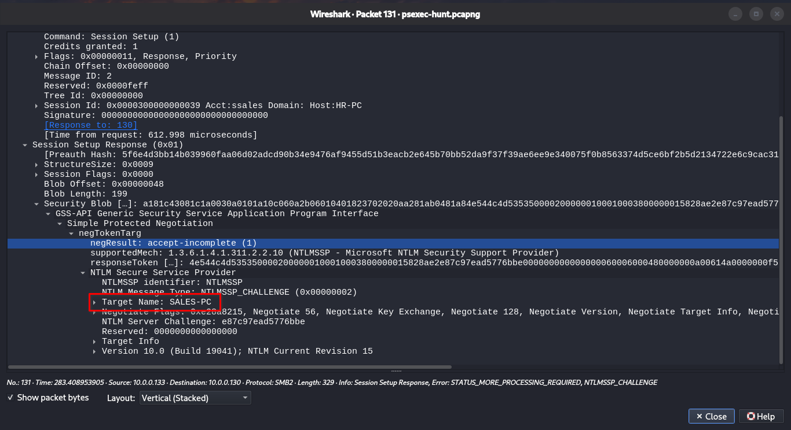

# PsExec Hunt Lab: Walkthrough

Step-by-step solution for each question, with the Wireshark filters and reasoning behind every answer.

## Step 0: Get Oriented

Open the PCAP in Wireshark and get a high-level view before filtering.

**Statistics > Protocol Hierarchy:** confirm SMB2, NTLMSSP, and DCERPC are present.

**Statistics > Conversations > IPv4:** note which hosts talk to each other the most.

Heavy SMB2 traffic between a small set of hosts is the first sign of lateral movement.


### Q1: To effectively trace the attacker's activities within our network, can you identify the IP address of the machine from which the attacker initially gained access?

**Goal:** find the machine the attacker was operating from.
1. Filter for SMB2 session setup requests:
   ```
   smb2.cmd == 1
   ```
2. Look at who initiates the connections. The source of the authentication attempts toward other hosts is the attacker's machine.
3. Cross-check in *Statistics > Conversations* that this host is the one opening SMB sessions to others.

**Answer:** `10.0.0.130`


### Q2: To fully understand the extent of the breach, can you determine the machine's hostname to which the attacker first pivoted?

**Goal:** identify the first machine the attacker moved to.

1. Filter for NTLM authentication:
   ```
   ntlmssp
   ```
2. Open an `NTLMSSP_CHALLENGE` packet from the target. Under **NTLM Server Challenge > Target** Info check **NetBIOS Computer Name** and **DNS Computer Name**.
3. The destination of the first SMB session from `10.0.0.130` gives the first pivot.

**Answer:** `SALES-PC`



### Q3: Knowing the username of the account the attacker used for authentication will give us insights into the extent of the breach. What is the username utilized by the attacker for authentication?

**Goal:** identify the account the attacker used.

1. Filter for the NTLM authenticate message:
   ```
   ntlmssp.auth.username
   ```
2. Expand the packet: *NTLM Secure Service Provider* and read **User name**, **Domain name**, and **Host name**.

**Answer:** `ssales`


### Q4: After figuring out how the attacker moved within our network, we need to know what they did on the target machine. What's the name of the service executable the attacker set up on the target?


