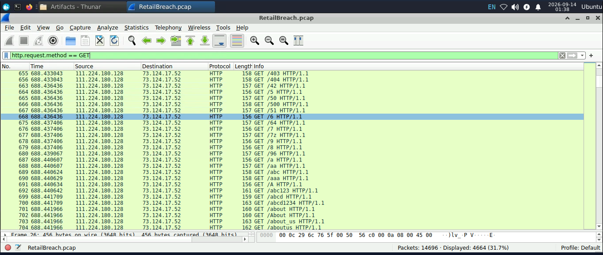

## Cyberdefender lab - RetailBreach

## ⚠️ Disclaimer ⚠️

This write-up is for educational purposes only. It is meant to explain the thought process and steps taken to solve the challenge.

Please do not simply copy and paste the answers, as this may slow down your technical growth and prevent you from building real problem-solving skills.

Always try the challenge on your own first. Use this write-up only as a guide to understand the approach, not as a shortcut. Real skills are built through practice, trial and error, and persistence.

## CyberDefender Lab Write-ups

[Cyberdefender](https://cyberdefenders.org/walkthroughs/retailbreach/)

## Overview

This write-up documents my investigation of the RetailBreach lab on CyberDefenders, focusing on analyzing suspicious activity, identifying key indicators, and understanding the attacker's actions.

## Lab Information

**1- Lab Title:** RetailBreach.

**2- Course:** Network Forensics.

## Objective

The objective of this lab is to investigate suspicious network activity, identify the web application vulnerabilities exploited by the attacker, and trace their attack activity. This includes analyzing the XSS payload, extracting the administrator's session token, and determining how the attacker gained unauthorized access to restricted resources.

## Q1: Identifying an attacker's IP address is crucial for mapping the attack's extent and planning an effective response. What is the attacker's IP address?

I started by analyzing the HTTP traffic in Wireshark using the following filter: `http.request.method == GET`, I noticed a large number of HTTP GET requests originating from the same IP address within a short period of time, The source IP `111.224.180.128` was repeatedly sending requests to the server 73.124.17.52, while continuously changing the requested paths.

The high frequency and changing URI paths suggested automated web enumeration or path discovery rather than normal user activity.

## Q2: The attacker used a directory brute-forcing tool to discover hidden paths. Which tool did the attacker use to perform the brute-forcing?

To identify the tool used by the attacker, I inspected the HTTP streams and examined the HTTP request headers, particularly the `User-Agent` field.

The following User-Agent was identified: `User-Agent: gobuster/3.6`

This indicates that the attacker used Gobuster version 3.6 to perform directory brute-forcing and discover hidden paths on the server.

## Q3: Cross-Site Scripting (XSS) allows attackers to inject malicious scripts into web pages viewed by users. Can you specify the XSS payload that the attacker used to compromise the integrity of the web application?

