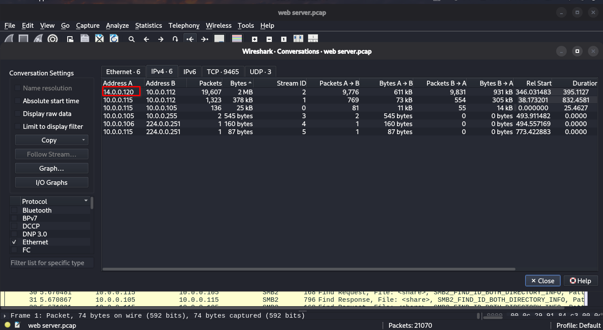
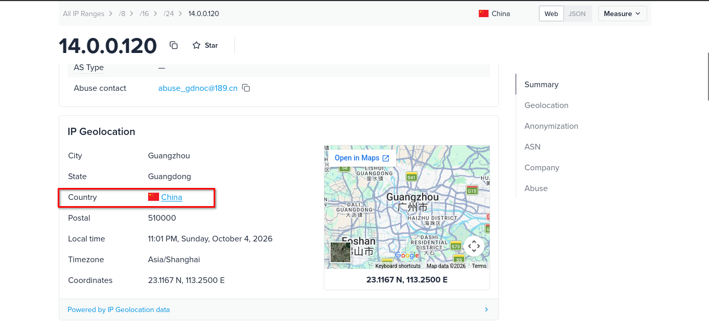
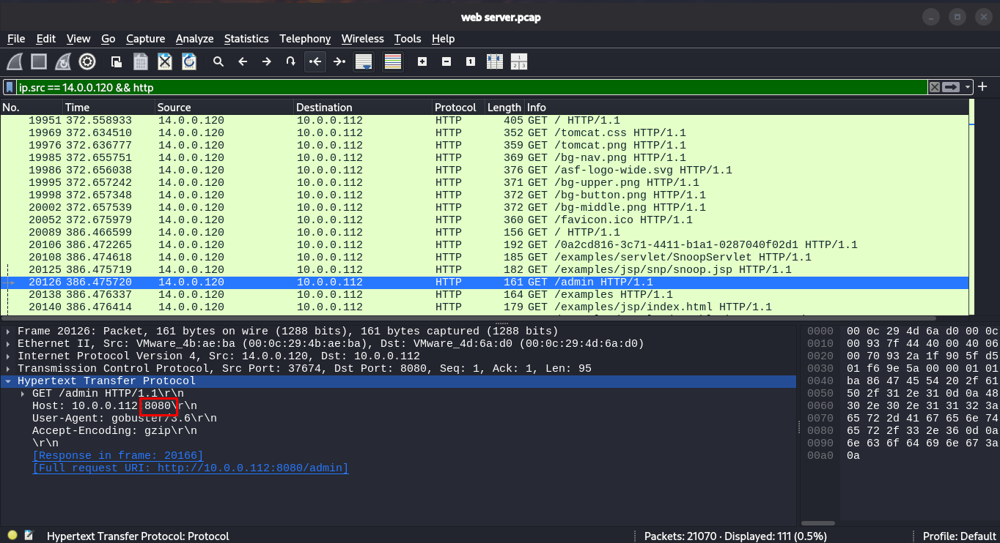
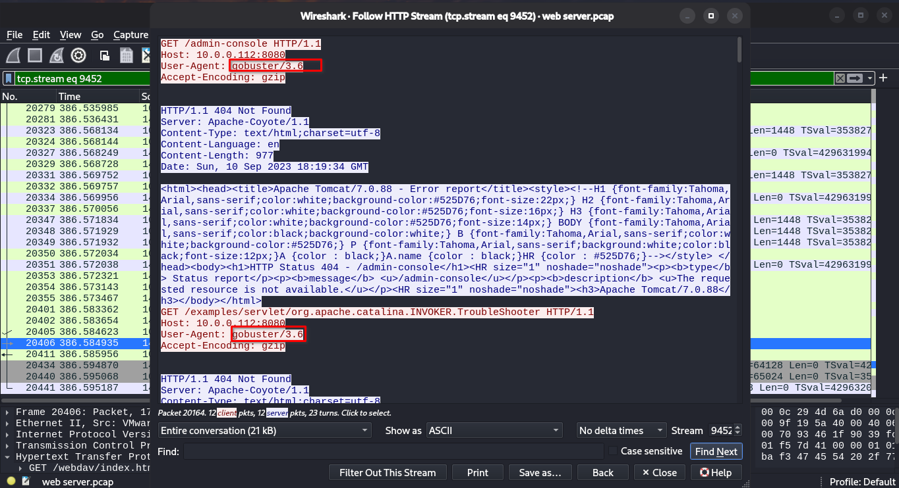
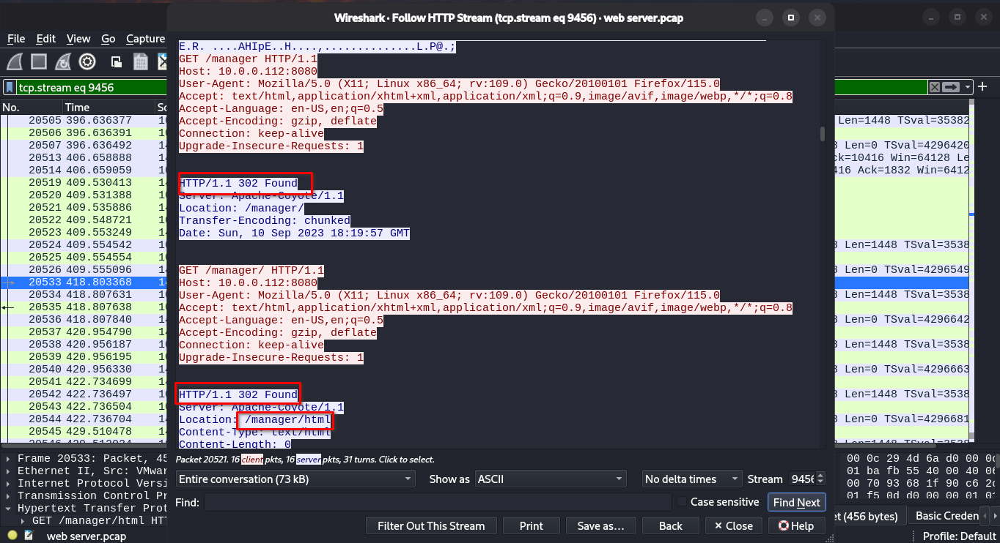
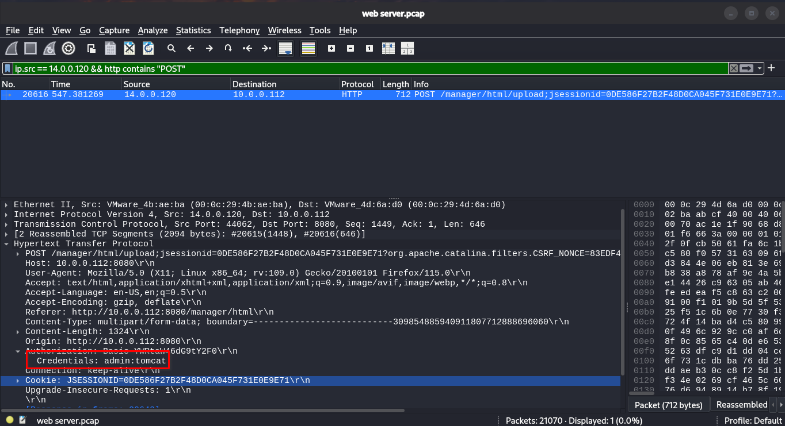
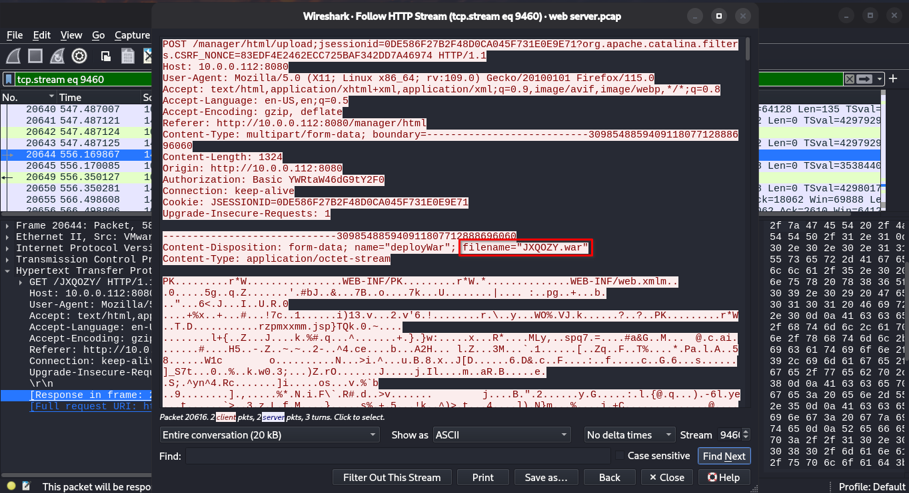

# Tomcat Takeover Lab: Walkthrough

Step-by-step investigation of the PCAP, following the attacker from first contact to persistence.

## Step 0: Get Oriented

Before filtering, get a high-level view of the capture.

- **Statistics > Protocol Hierarchy:** confirm HTTP and TCP dominate.
- **Statistics > Conversations > IPv4:** find the external host with the most traffic to the server.
- **Statistics > Endpoints:** note the server IP and port (Tomcat usually listens on `8080`).

### Q1: Given the suspicious activity detected on the web server, the PCAP file reveals a series of requests across various ports, indicating potential scanning behavior. Can you identify the source IP address responsible for initiating these requests on our server?

**Goal:** identify the external host attacking the server.

1. Open *Statistics > Conversations > IPv4* and sort by packets.
2. Identify the external IP with abnormal volume toward the server.

**Answer:** `14.0.0.120`



### Q2: Based on the identified IP address associated with the attacker, can you identify the country from which the attacker's activities originated?

**Goal:** find where the attacker's IP is located.

1. Use any Threat Intel website that you search on it about the attacker ip (like [IPINFO](https://ipinfo.io))
2. And after that you can see the country of the attacker



**Answer:** `China`

### Q3: From the PCAP file, multiple open ports were detected as a result of the attacker's active scan. Which of these ports provides access to the web server admin panel?

**Goal:** determine which ports the attacker found during scanning.

1- Use this filter to capture the http request to admin panal.
```
  ip.src == 14.0.0.120 && http
```
**Answer:** `8080`



### Q4: Following the discovery of open ports on our server, it appears that the attacker attempted to enumerate and uncover directories and files on our web server. Which tools can you identify from the analysis that assisted the attacker in this enumeration process?

**Goal:** Knowing what tool used to enumeration the web server.

1- Use the same filter from Q3 and Follow HTTP Stream and look for the header `User-Agent`.

2- You will see the name of the tool that used.

**Answer:** `gobuster`



### Q5: After enumerating directories on our web server, the attacker made numerous requests to identify administrative interfaces. Which directory related to the admin panel did the attacker uncover?

**Goal:** find the management interface the attacker located

1. Filter attacker HTTP requests:
   ```
   http.request && ip.src == 14.0.0.120
   ```
2. Look for a burst of requests to many paths (directory enumeration), many returning `404`.
3. Find the request that returns a different response.

**Answer:** `/manager`



### Q6: After accessing the admin panel, the attacker brute-forced the login. What credentials did the attacker successfully use? 

**Goal:** recover the username and password that gave the attacker access.

1- Find a request that with http method `POST`
```
  ip.src == 14.0.0.120 && http contains "POST"
```
2- Expand the packet: *Hypertext Transfer Protocol > Authorization > Credentials* shows the username and password.

**Answer:** `admin:tomcat`



### Q7: Once inside the admin panel, the attacker attempted to upload a file with the intent of establishing a reverse shell. Can you identify the name of this malicious file from the captured data?

**Goal:** identify the payload the attacker deployed.

1- Filter for uploads:
```
  ip.src == 14.0.0.120 && http contains "upload"
```
2- Use *Follow > TCP Stream* to read the request. The `filename=` field in the multipart body shows the file name.

**Answer:** `JXQOZY.war`



### Q8: After the attacker established a reverse shell on our server, the payload connects back to the attacker's machine. From the analysis, what is the callback destination in IP:port format?

**Goal:** find how the attacker kept access to the server.

1. Find the connection back from the server to the attacker (reverse shell):
   ```
   ip.src == <server_ip> && ip.dst == <attacker_ip> && !http
   ```
2. Follow the TCP stream to read the commands typed in the shell.


